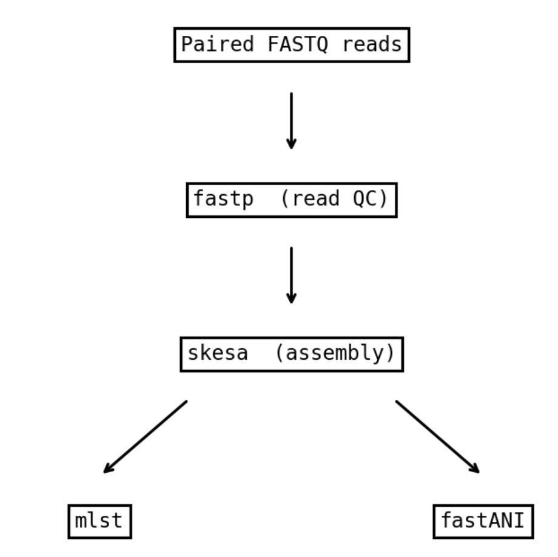

# Bacterial Genomics Nextflow Pipeline

**BIOL7210 – Workflow Exercise**

## Workflow Overview

| Step | Module | Tool | Description |
|------|--------|------|-------------|
| 1 | `FASTP` | fastp | Trim adapters and filter low-quality reads |
| 2 | `SKESA` | skesa | *De novo* genome assembly from cleaned reads |
| 3a | `MLST` | mlst | Sequence type assignment (runs in **parallel** with 3b) |
| 3b | `FASTANI` | fastANI | Average nucleotide identity vs. a reference genome (runs in **parallel** with 3a) |

- **Sequential flow:** FASTP → SKESA (output of each step feeds the next)
- **Parallel flow:** MLST and FastANI both consume SKESA output independently and execute simultaneously

## Requirements

| Dependency | Version | Notes |
|------------|---------|-------|
| **Nextflow** | 24.10.5 | Workflow language |
| **Conda** | ≥ 24.x | Package manager; pipeline auto-creates per-process envs |
| **OS** | macOS (ARM64/x86_64) or Linux (x86_64) | Tested on macOS Sequoia ARM64 |

## Test Data

Test data is located in `test_data/` and contains:

- `ecoli_1.fastq.gz` / `ecoli_2.fastq.gz` — Mini paired-end reads (~1,000 read pairs) from *E. coli* accession **SRR10971381**
- `reference.fna` — *E. coli* K-12 MG1655 reference genome (GCF_000005845.2)

To regenerate the test data from scratch:

```bash
bash bin/generate_test_data.sh
```

## Quick Start

### 1. Create the Nextflow environment (one-time setup)

```bash
conda create -n nf -c bioconda nextflow=24.10.5 -y
```

### 2. Activate and run example

```bash
conda activate nf
nextflow run main.nf -profile conda
```

### 3. Outputs

Results are written to `results/`:

```
results/
├── fastp/          # Trimming reports (HTML + JSON) and cleaned reads
├── assemblies/     # Assembled contigs (.fna)
├── mlst/           # MLST typing results (.tsv)
└── fastani/        # ANI comparison results (.tsv)
```

## Using Custom Data

```bash
nextflow run main.nf -profile conda \
  --reads '/path/to/reads/*_{1,2}.fastq.gz' \
  --reference /path/to/reference.fna \
  --outdir /path/to/output
```

## Workflow Diagram 


## Repository Structure

```
.
├── main.nf              # Main workflow entry point
├── nextflow.config      # Profiles and process defaults
├── modules/
│   ├── fastp.nf         # Read QC module
│   ├── skesa.nf         # Assembly module
│   ├── mlst.nf          # MLST module
│   └── fastani.nf       # FastANI module
├── envs/
│   ├── fastp.yml        # Conda env spec
│   ├── skesa.yml
│   ├── mlst.yml
│   └── fastani.yml
├── test_data/           # Mini test dataset
├── bin/
│   └── generate_test_data.sh
└── README.md
```
